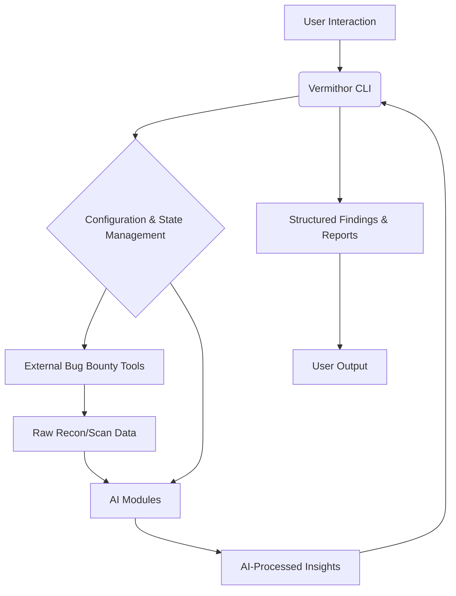

# Vermithor Architecture

This document provides a detailed overview of Vermithor's architecture, including its core components, data flow, and how it integrates AI into the bug bounty workflow.

## 1. High-Level Overview

Vermithor is a Python-based CLI tool that acts as an orchestration layer for various bug bounty tools, enhanced by AI-powered modules. Its primary goal is to automate repetitive tasks, provide intelligent insights, and streamline the reporting process for security researchers.

## 2. Core Components

### 2.1. Vermithor CLI (`vermithor/main.py`)

*   **Role:** The primary interface for users. It parses commands, manages the workflow, and orchestrates calls to internal modules and external tools.
*   **Technology:** Built using Python's `argparse` module for command-line argument parsing.

### 2.2. Configuration Management (`vermithor/config.py`)

*   **Role:** Handles loading, saving, and retrieving configuration settings, including API keys for LLM providers and paths to external tools.
*   **Features:**
    *   **Persistent Storage:** Stores configuration in a JSON file (`~/.vermithor_config.json`) for persistence across sessions.
    *   **LLM Model Selection:** Allows users to specify preferred LLM models for different tasks (reconnaissance, prioritization, reporting) based on cost, speed, and capability.

### 2.3. AI Modules (`vermithor/ai_modules/`)

These modules are the brain of Vermithor, leveraging Large Language Models (LLMs) to provide intelligent automation and insights. They interact with LLMs using the `openai` Python SDK, which is pre-configured to work with Manus's built-in LLM proxy.

#### 2.3.1. Recon Analyzer (`recon_analyzer.py`)

*   **Purpose:** Transforms raw reconnaissance data into actionable intelligence.
*   **Inputs:** Subdomains, open ports, identified technologies, historical data, DNS records, etc.
*   **Outputs:** Structured summary, prioritized targets, and suggested next steps for deeper investigation.
*   **LLM Interaction:** Uses advanced LLMs (e.g., `claude-sonnet-4-6`, `gemini-3.1-pro-preview`) with JSON schema for structured output to ensure consistent and parseable results.

#### 2.3.2. Vulnerability Prioritizer (`vuln_prioritizer.py`)

*   **Purpose:** Analyzes vulnerability scan results to filter noise, assess impact, and suggest chaining opportunities.
*   **Inputs:** Output from various vulnerability scanners (e.g., Nuclei, custom scripts).
*   **Outputs:** Prioritized list of vulnerabilities with severity, estimated impact, confidence scores, and recommendations for manual verification or chaining.
*   **LLM Interaction:** Employs LLMs (e.g., `gpt-5`, `claude-sonnet-4-6`) for nuanced analysis, leveraging their reasoning capabilities to identify potential false positives and complex attack paths.

#### 2.3.3. Report Generator (`report_generator.py`)

*   **Purpose:** Automates the drafting of comprehensive bug bounty reports.
*   **Inputs:** Structured vulnerability findings, proof-of-concept (PoC) details, and impact assessments.
*   **Outputs:** Formatted bug reports tailored for platforms like HackerOne, Bugcrowd, etc.
*   **LLM Interaction:** Utilizes LLMs (e.g., `gpt-5-mini`, `claude-haiku-4-5`) for text generation, focusing on clarity, conciseness, and adherence to reporting standards.

### 2.4. Tool Wrappers (`vermithor/tools/`)

*   **Role:** Provide a standardized Pythonic interface for executing external command-line bug bounty tools.
*   **Functionality:** Each wrapper encapsulates the logic for running a specific tool (e.g., `subfinder`, `nuclei`, `httpx`), handling its command-line arguments, execution, and parsing its output into a structured format that can be consumed by Vermithor's AI modules.

### 2.5. Utilities (`vermithor/utils/`)

*   **Role:** A collection of general-purpose helper functions.
*   **Examples:** File I/O operations (`file_operations.py`), data parsing and formatting (`data_processing.py`), and other common tasks that support the main workflow.

### 2.6. Data Models (`vermithor/models/`)

*   **Role:** Defines Python data structures for consistent representation of data throughout the application.
*   **Technology:** Will likely use `dataclasses` or `Pydantic` for type-safe and easily serializable data models for reconnaissance results, vulnerability findings, and report components.

## 3. Data Flow and Workflow

Vermithor's workflow is designed to mimic and enhance a typical bug bounty hunter's process:

1.  **Initialization:** User runs `vermithor` command with a target.
2.  **Tool Orchestration:** Vermithor's CLI invokes relevant tool wrappers (e.g., `subfinder_wrapper.py`, `httpx_wrapper.py`) to gather raw data.
3.  **AI Analysis (Recon):** Raw recon data is fed into `ReconAnalyzer` which uses an LLM to identify key assets and suggest further actions.
4.  **Targeted Scanning:** Based on AI insights, Vermithor can then trigger more specific scans using tools like Nuclei.
5.  **AI Analysis (Vulnerability):** Scan results are passed to `VulnPrioritizer`, which uses an LLM to filter, prioritize, and suggest manual verification steps.
6.  **Reporting:** Confirmed findings, along with PoC details, are sent to `ReportGenerator` to draft a submission-ready report.

This iterative process, guided by AI, aims to reduce manual effort, improve the quality of findings, and accelerate the overall bug bounty lifecycle.
